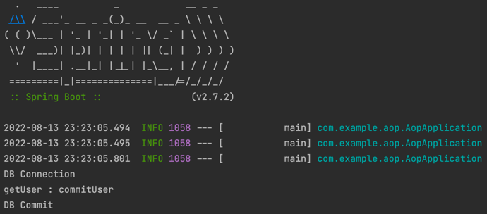
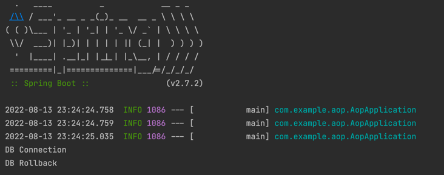

# AOP Study
## 코드로 확인하는 동작 순서
- CglibAopProxy.java : CGLib 기반의 AOP Proxy
  - DynamicAdvisedInterceptor class
    - intercept method
- CglibAopProxy.java
  - CglibMethodInvocation
    - proceed method
- ReflectiveMethodInvocation.java
  - proceed method : 인터셉터. point cut은 객체가 생성되기 전에 평가된다. point cut이 먼저 확인되는 이유는 Adivce가 적용될 위치를 상세하게 확인하기 위함
- AspectJAroundAdvice.java
  - invoke method : AroundAdivce 실행
  - ProxyMethodInvocation : 메소드가 프록시에 접근하기 위한 인터페이스 
    ProceedingJoinPoint : Adivce의 프로세스를 도와주는 인터페이스 
    JoinPointMatch : Advice를 적용할 시점(join point)가 입력된 JoinPoint와 적합한지 확인하는 인터페이스
- AbstractAspectJAdvice
  - invokeAdviceMethodWithGivenArgs : Advice등록해놓은 메소드 실행

## Proxy
- 클라이언트가 사용하려는 Target으로 위장하여 요청을 받는 곳
- 프록시 객체에 트랜잭션 등 부가 기능 관련 로직을 위치시키고, 클라이언트 요청이 발생하면 실제 타깃 객체는 프록시로부터 요청을 위임받아 핵심 비즈니스 로직을 실행  
  
### @Transcational 예제
```
public class TransactionalEventServiceProxy implements TransactionalEventService {

    private final TransactionalEventService service;

    public TransactionalEventServiceProxy(TransactionalEventService service) {
        this.service = service;
    }

    @Override
    public void getUserById(String id) {
        // DB 커넥션
        System.out.println("DB Connection");
        try {
            service.getUserById(id);
            // DB commit
            System.out.println("DB Commit");
        } catch (RuntimeException e) {
            // DB rollback
            System.out.println("DB Rollback");
        }
    }
}
```
- Commit 결과


- Rollback 결과



## 구성
### Target
- Aspect를 적용시킬 곳
```
void createEvent();
void publishEvent();
void deleteEvent();
```
### Advice
- 어떤 일을 해야할지에 대한 것
```
public Object calculateProcessTime(ProceedingJoinPoint pjp) throws Throwable {
    long begin = System.currentTimeMillis();
    ... 
    System.out.println(System.currentTimeMillis() - begin);
    return retVal;
}
```
### JointPoint
- Advice가 실행되는 곳
```
public Object calculateProcessTime(ProceedingJoinPoint pjp) throws Throwable {
    ...
    Object retVal = pjp.proceed();
    ...
    return retVal;
}
```
### PointCut
- JointPoint의 상세한 내용
```
@Around("execution(* com.example.aop.service.EventService.*(..))")
```

## Next Study
- Annotation 구성 방법
- Decoration Pattern